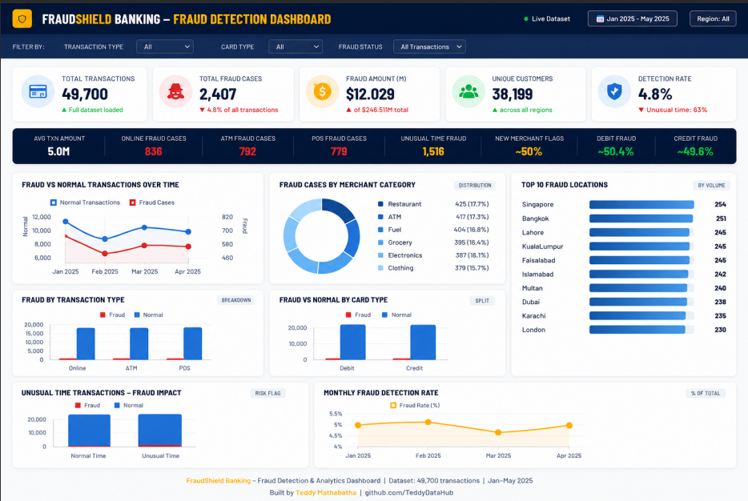

# FraudShield Banking Analytics Project

An interactive, end-to-end banking analytics and fraud detection projec solutiont built entirely within Power BI to transform raw transactional data into actionable financial risk intelligence.

## 📊 Dashboard Preview

## 🔍 Key Project Insights
* **Financial Exposure:** Analyzed 49,700 total transactions to track 2,407 fraud cases totaling $12.03M, maintaining a 4.8% overall detection rate.
* **Channel Analysis:** Visualized fraud vs. normal transaction volumes across Online, ATM, and POS channels, highlighting specific risk spikes during unusual timeframes.
* **Behavioral & Geographic Trends:** Isolated high-risk merchant categories (led by Restaurants and ATMs) and mapped the top 10 global fraud locations.

## 🛠️ Tech Stack & Power BI Capabilities
* **Power Query:** Utilized for end-to-end Data Extraction, Transformation, and Loading (ETL), including data cleaning, profiling, and schema structuring.
* **Data Modeling:** Established a robust star schema database design linking transactional tables with dimension tables.
* **DAX (Data Analysis Expressions):** Formulated advanced measures and calculated columns to drive dynamic KPIs, time-intelligence insights, and custom fraud-detection thresholds.
* **Data Visualization:** Designed an interactive, executive-ready dashboard with targeted filtering capabilities for risk management teams.
